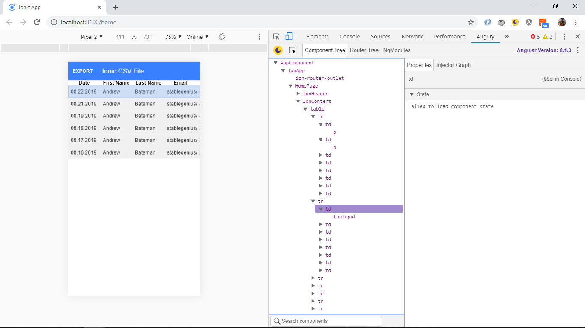

# :zap: Ionic Angular Explorer

* App to open a locally-stored Comma Separated Values (CSV) file and allow it to be modified and saved/shared via a social media plugin if using a mobile or as a xls file if using a PC.
* This is another great tutorial from [Simon Grimm of the IonicAcademy](https://www.youtube.com/user/saimon1924) - see [:clap: Inspiration](#clap-inspiration) below.
* **Note:** to open web links in a new window use: _ctrl+click on link_


## :page_facing_up: Table of contents

* [:zap: Ionic Angular Explorer](#zap-ionic-angular-explorer)
  * [:page_facing_up: Table of contents](#page_facing_up-table-of-contents)
  * [:books: General info](#books-general-info)
  * [:camera: Screenshots](#camera-screenshots)
  * [:signal_strength: Technologies](#signal_strength-technologies)
  * [:floppy_disk: Setup](#floppy_disk-setup)
  * [:computer: Code Examples](#computer-code-examples)
  * [:cool: Features](#cool-features)
  * [:clipboard: Status & To-do list](#clipboard-status--to-do-list)
  * [:clap: Inspiration](#clap-inspiration)
  * [:file_folder: License](#file_folder-license)
  * [:envelope: Contact](#envelope-contact)

## :books: General info

* Includes 'export' button top left to save the file to social media etc.
* The **Cordova-plugin-file** plugin implements a File API allowing read/write access to files stored on the device.
* The **cordova-plugin-x-socialsharing** shares text, files, images and links via social networks, sms and email.

## :camera: Screenshots



## :signal_strength: Technologies

* [Ionic v6](https://ionicframework.com/)
* [Ionic/angular v6](https://ionicframework.com/)
* [Angular v15](https://angular.io/)
* [cordova-plugin-file v7](https://cordova.apache.org/docs/en/latest/reference/cordova-plugin-file/)
* [cordova-plugin-x-socialsharing v6](https://ionicframework.com/docs/native/social-sharing)
* [mholt: Fast and powerful CSV (delimited text) parser - github link](https://github.com/mholt/PapaParse)
* [ngx-papaparse v6](https://github.com/alberthaff/ngx-papaparse) & [Albert Haff website](https://alberthaff.dk/projects/ngx-papaparse/docs/v4)

## :floppy_disk: Setup

* To start the server on _localhost://8100_ type: 'ionic serve'
* To start the server on a mobile using Ionic devapp and connected via wifi, type: 'ionic serve --devapp'
* The Ionic DevApp was installed on an Android device from the Google Play app store.

## :computer: Code Examples

* code from Cordova plugin to open a file on a mobile device file system with its default application

```typescript
// parse data asynchronously as per papa parse documentation.
this.papa.parse(csvData, {
    complete: parsedData => {
    this.headerRow = parsedData.data.splice(0, 1)[0];
    this.csvData = parsedData.data;
    console.log('data array: ', this.csvData);
    }
});
```

## :cool: Features

* CSV file access and editing.

## :clipboard: Status & To-do list

* Status: Working. Tested using Ionic server and Ionic devapp. Passes linting.
* To-do: nothing

## :clap: Inspiration

* [Simon Grimm IonicAcademy Youtube video 'Ionic Native File Explorer'](https://www.youtube.com/watch?v=tyZjicNtbyk)
* [Written version of tutorial from Devtactic website: How to Import & Export CSV Data using Papa Parse with Ionic](https://devdactic.com/csv-data-papa-parse-ionic/)

## :file_folder: License

* This project is licensed under the terms of the MIT license.

## :envelope: Contact

* Repo created by [ABateman](https://github.com/AndrewJBateman), email: gomezbateman@yahoo.com
